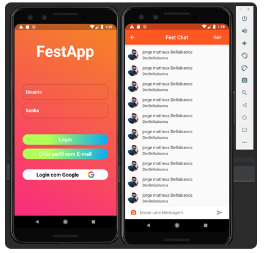

# festapp

Um aplicativo de <b>Chat</b> desenvolvido e testado em <b>Android</b>, utilizando o banco de dados <b>Firebase</b>, com autenticação <b>Google Account</b>, o app foi desenvolvido em <b>Flutter (Dart)</b>.

